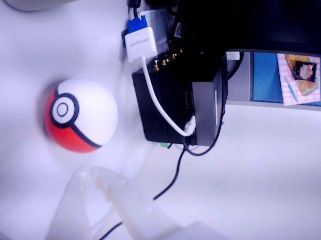
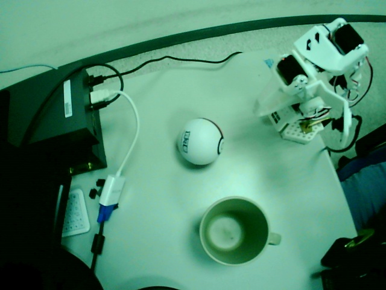

# GR00T N1.6 x LeRobot SO-101 x Jetson AGX Thor

以 NVIDIA Isaac GR00T N1.6 微調 LeRobot SO-101 機械臂，並部署於 Jetson AGX Thor 的完整流程。

**參考來源**: https://wiki.seeedstudio.com/fine_tune_gr00t_n1.5_for_lerobot_so_arm_and_deploy_on_jetson_thor/

> **注意**：上述 wiki 是基於 N1.5 撰寫的，本專案已升級至 N1.6。差異說明見下方。

---

## 訓練資料示範

**攝影機擺位參考**（`scripts/check_cameras.sh` 產出的定格畫面）：

| 前視角（front, video2）| 腕視角（wrist, video0）|
|-----------------------|----------------------|
|  |  |
| 從正面拍攝手臂全身與工作區 | 固定在夾爪上方，往下看抓取目標 |

以下是 teleoperation 收集的訓練資料片段（episode 000，任務：`pick up the ball and place it in the cup`）。人類透過 leader 手臂帶動 follower，雙攝影機同步記錄作為 GR00T 微調的視覺輸入：

| 前視角（front, video2）| 腕視角（wrist, video0）|
|-----------------------|----------------------|
| https://github.com/harry18456/gr00t-so101-thor/raw/main/docs/training/training_episode_000_front.mp4 | https://github.com/harry18456/gr00t-so101-thor/raw/main/docs/training/training_episode_000_wrist.mp4 |

- **總資料量**：50 episodes / 29,705 frames / 16.5 分鐘（詳見 [6.1 節](#61-使用內建腳本)）
- **每 episode**：約 19.8 秒、594 frames、30 FPS
- **同步資料**：每一 frame 都對應 parquet 中的 6 軸 follower 狀態 + leader 動作指令
- 示範檔放在 `docs/training/`，從 `datasets/so101_pick_place_v2/videos/chunk-000/` 挑出 episode 000 複製而來。完整 50 集在本地 `datasets/` 目錄（已 gitignore）。

---

## GR00T 模型簡介

GR00T（**G**eneralist **R**obot **00** **T**echnology）是 NVIDIA 開發的 **Vision-Language-Action (VLA)** 基礎模型，專為通用機器人操控設計。核心概念是：**看圖 + 聽指令 + 感知狀態 → 輸出動作**。

### 架構

GR00T N1.6 是 3B 參數的多模態模型，由三個模組組成：

| 模組 | 說明 |
|------|------|
| **Vision Encoder**（Eagle-Block2A-2B-v2）| 將攝影機影像編碼為 visual tokens（輸入 448×448，推論時縮放至 256×256）|
| **Language Model**（Qwen2 Tokenizer）| 處理自然語言任務描述，讓模型理解「要做什麼」|
| **Diffusion Transformer (DiT)**（32 層）| 結合 vision + language + 機器人狀態，透過 diffusion 預測未來的動作軌跡 |

### 輸入 / 輸出

| 輸入 | 說明 |
|------|------|
| 攝影機影像 | 1～2 個視角（如 front + wrist）|
| 語言指令 | 自然語言任務描述（如 "pick up the ball and place it in the cup"）|
| 機器人狀態 | 當前關節角度（state vector）|

| 輸出 | 說明 |
|------|------|
| Action trajectory | 未來 N 步的關節動作序列（action horizon 最大 50，本專案使用 16）|

### 設計特點

- **Embodiment-agnostic**：透過 `embodiment_tag` + `modality_config` 適配不同機器人（SO-100、Panda、GR1 等），最大支援 128 維 state/action
- **預訓練 + 微調**：NVIDIA 用大量機器人資料預訓練，使用者只需少量示範資料（幾十～幾百個 episode）即可微調到自己的任務
- **State-relative prediction**（N1.6）：預測相對動作而非絕對位置，泛化能力更好，但更容易 overfit

### 語言指令的角色

語言指令貫穿整個流程：

```
收集資料: --task="pick up the ball and place it in the cup"  ← 記錄在 tasks 中
微調訓練: 模型學到「這組影像+狀態+動作」對應這句描述
推論部署: --lang_instruction="pick up the ball and place it in the cup"  ← 模型據此決定行為
```

單任務微調時，語言指令的影響較小（模型只學過一種行為）。多任務微調時，語言指令是區分不同任務的關鍵。

### Human in the Loop (HITL)

本專案採用 **Human in the Loop** 的學習方式——模型透過模仿人類示範來學習，而非自行探索：

```
┌─────────────────────────────────────────────────────────┐
│  Human in the Loop          Human out of the Loop       │
│                                                         │
│  人類遙操作示範 → 錄製資料 → 微調模型 → 模型自主執行    │
│  (teleop)         (record)   (fine-tune)  (inference)   │
│       ↑                                       │         │
│       └──── 效果不好？再補幾個示範 ────────────┘         │
└─────────────────────────────────────────────────────────┘
```

| 階段 | 人類角色 | 說明 |
|------|----------|------|
| 資料收集 | **直接操控**（in the loop）| 人類操控 leader 手臂，follower 跟隨並錄製動作 |
| 微調訓練 | 不參與 | 模型從人類示範中學習模仿 |
| 推論部署 | **監督**（on the loop）| 模型自主執行，人類觀察必要時介入 |
| 持續改進 | **回到 loop** | 模型表現不佳時，補充更多人類示範後重新微調 |

這個循環是漸進式的：先收集少量示範（如 10 個 episode）→ 微調測試 → 根據效果決定是否需要更多資料。

### 模擬 vs 真實資料

純靠真實遙操作收集資料很慢（50 episodes 需要人手動操作約 30 分鐘），這也是 NVIDIA 推出 **Isaac Sim / Isaac Lab** 模擬平台的原因。

NVIDIA 機器人 AI 全棧：

```
Isaac Sim / Isaac Lab   模擬環境（基於 Omniverse 物理引擎）
        ↓               可平行跑數百個機器人、自動隨機化場景
GR00T 預訓練            大量模擬 + 真實資料混合訓練
        ↓
少量真實資料微調         ← 本專案在這一步（Sim-to-Real transfer）
        ↓
Jetson Thor 部署        邊緣即時推論
```

業界主流做法是 **Sim-to-Real**：先在模擬裡大量訓練，再用少量真實資料微調，彌補模擬與真實的差距（sim-to-real gap）。

| 方法 | 前期成本 | 資料收集成本 | 適合場景 |
|------|---------|------------|---------|
| 純真實 teleop | 低（插上手臂就開錄）| 高（人力 × 時間）| 簡單任務、少量資料就夠 |
| 純模擬 | 高（需建 3D 模型、調物理參數）| 極低（自動大量生成）| 複雜任務、需要大量資料 |
| 模擬 + 真實微調 | 中高 | 中 | 業界主流 |

本專案選擇純真實 teleop，因為任務單純（抓球放杯子）且 SO-101 沒有現成的模擬模型。對於更複雜的任務（多物體操控、雙臂協作等），建模擬環境的前期投入才值得。

---

## 為什麼從 N1.5 升級到 N1.6

Seeed Studio wiki 教學原本使用 GR00T N1.5，但 Isaac-GR00T `main` branch 已更新至 N1.6。
經比較後決定直接使用 N1.6：

| | N1.5 | N1.6 |
|---|------|------|
| VLM 骨幹 | 舊版 | Cosmos-Reason-2B（更強）|
| DiT 層數 | 16 層 | **32 層（2 倍大）**|
| 動作表示 | 絕對關節角度 | **相對動作（state-relative）**|
| 收斂速度 | 較慢 | 更快（但更容易 overfit）|
| 微調腳本 | `scripts/gr00t_finetune.py` | `gr00t/experiment/launch_finetune.py` |
| 預訓練模型 | `nvidia/GR00T-N1.5-3B` | `nvidia/GR00T-N1.6-3B` |

**資料格式相容**：LeRobot v2.0 格式不變，已收集的資料集不需重錄。
差異在於 N1.6 使用相對動作預測，對應的 config 已在 `examples/SO100/so100_config.py` 更新。

> 若需使用 N1.5，切換至 `n1.5-release` branch：`git checkout n1.5-release`

---

## 目前環境狀態

| 項目 | 狀態 |
|------|------|
| OS | Ubuntu 24.04.3 LTS (kernel 6.8.12-tegra) |
| GPU | NVIDIA Thor |
| Driver | 580.00 |
| CUDA | 13.0 |
| Docker | 29.3.1（已安裝）|
| Python | 3.12.3（系統，Thor 正確版本）|
| uv | 0.11.2（已安裝）|
| Isaac-GR00T | git submodule（main branch = N1.6）|
| GR00T 環境 | 已安裝（Isaac-GR00T/.venv）|
| GR00T-N1.5-3B 模型 | 已下載（Isaac-GR00T/pretrained/GR00T-N1.5-3B，5.1GB）|
| GR00T-N1.6-3B 模型 | 已下載（Isaac-GR00T/pretrained/GR00T-N1.6-3B）|
| N1.6 推論 Server 測試 | ✓ 模型載入成功（DiT 1.09B params），pretrained 不含 SO100 config 屬正常（需 fine-tune 後才有）|
| N1.6 Fine-tune 測試 | ✓ 用 demo_data/cube_to_bowl_5 跑 5 步成功（train_loss=1.099），checkpoint 含 `new_embodiment` config |
| E2E Pipeline 測試 | ✓ fine-tune → server → client 推論全流程通過（2026-04-11），action shape (1,16,5)+(1,16,1) |
| wandb | 已安裝（0.23.0）|
| so100_config.py | ✓ 已確認符合 SO-101（2 cam、6 joints + gripper、16 步 action horizon）|
| CH34x 驅動 | 已安裝（CH341SER submodule，kernel module 已載入）|
| lerobot（eval 用）| 已安裝（0.4.1，`--no-deps` 安裝以避免覆蓋 PyTorch）|
| draccus / pyserial | 已安裝（eval client 依賴）|
| feetech-servo-sdk | 已安裝（scservo_sdk，手臂 servo 通訊）|
| rerun-sdk | 已安裝（lerobot 遙操作視覺化）|
| SO-101 手臂 | ✓ 已接上並校準，遙操作測試通過（leader→follower 60Hz）|
| 手臂 Port 對應 | `/dev/ttyACM0` = leader、`/dev/ttyACM1` = follower（插拔後可能交換，用 `scripts/preflight_check.sh` 確認）|
| 手臂校準檔 | `~/.cache/huggingface/lerobot/calibration/` （Thor 上重新校準）|
| USB 攝影機 | `video0` = wrist cam（朝下看桌面）、`video2` = front cam（從前方看手臂），兩台必須接不同 USB hub chip |

---

## 目錄

0. [GR00T 模型簡介](#gr00t-模型簡介)
1. [硬體需求](#1-硬體需求)
2. [基礎環境安裝](#2-基礎環境安裝)
3. [GR00T 環境安裝（Thor）](#3-gr00t-環境安裝thor)
4. [驗證環境](#4-驗證環境)
5. [SO-101 手臂組裝與校正](#5-so-101-手臂組裝與校正)
6. [資料收集](#6-資料收集)
7. [模型微調](#7-模型微調)
8. [Jetson Thor 推論部署](#8-jetson-thor-推論部署)
9. [Scripts 總覽](#scripts-總覽)
10. [故障排除](#9-故障排除)

---

## 1. 硬體需求

### Jetson AGX Thor（本機）

Thor 是 NVIDIA 為**具身智能（Embodied AI）**設計的邊緣運算平台，與 GR00T 是同一生態系——GR00T 負責模型，Thor 負責部署推論。

本專案使用的是 **Thor T5000**：

| 規格 | Thor T4000 | Thor T5000（本機）| RTX 4090（桌機對比）|
|------|-----------|-------------------|---------------------|
| 架構 | Blackwell | Blackwell | Ada Lovelace |
| CUDA Cores | 1,536 | 2,560 | 16,384 |
| Tensor Cores | 64 | 96 | 512 |
| SM 數量 | ~12 | ~20 | 128 |
| 記憶體 | 64 GB LPDDR5X | **128 GB LPDDR5X** | 24 GB GDDR6X |
| AI 算力（FP4）| 1,200 TOPS | 2,070 TOPS | — |
| 功耗 | 40-70W | 40-130W | ~450W |

**為什麼用 Thor 而不是桌機 GPU？**

- **記憶體大**：128GB 統一記憶體，GR00T 3B 模型整個放得下不需量化
- **功耗低**：可以裝在機器人旁邊，不需連回伺服器
- **即時推論**：機器人控制需要低延遲，不能忍受網路來回

**Thor 的限制**：

- CUDA Cores 只有 RTX 4090 的 1/6，跑大語言模型（>7B）會很慢
- 設計甜蜜點是 **3B-7B** 等級的模型即時推論，剛好就是 GR00T 的大小
- 訓練也能跑（如本專案的微調），但速度不如桌機 GPU

### SO-101 手臂
- 主臂（Leader）+ 從臂（Follower）各一組
- 兩個 USB 攝影機（腕部攝影機 + 桌面攝影機）
- Serial 控制板（需 CH34x 驅動）

---

## 2. 基礎環境安裝

> 前提：OS 已完成安裝（Ubuntu 24.04、CUDA 13.0、JetPack 7.1）。

### 2.1 Clone 本專案（含所有 submodule）

```bash
git clone --recurse-submodules https://github.com/harry18456/gr00t-so101-thor.git
cd gr00t-so101-thor
```

本專案包含三個 git submodule：

| Submodule | 用途 |
|-----------|------|
| `Isaac-GR00T/` | NVIDIA GR00T N1.6 核心程式庫（fork 自 NVIDIA/Isaac-GR00T）|
| `SO-ARM100/` | SO-101 手臂校準資料與筆記 |
| `CH341SER/` | CH34x USB Serial 驅動原始碼 |

### 2.2 安裝系統工具

```bash
# 安裝 uv（Python 套件管理）
curl -LsSf https://astral.sh/uv/install.sh | sh
source ~/.bashrc

# 安裝系統套件
sudo apt update
sudo apt install -y nvidia-jetpack firefox

# 安裝 jetson-stats（GPU 監控）
# 注意：Thor 上的 Ubuntu 24.04 啟用了 PEP 668，不能用 sudo pip3 安裝系統套件
uv tool install jetson-stats
```

確認 GPU 狀態：

```bash
nvidia-smi
# 應顯示 Driver 580.00、CUDA 13.0

jtop
# 即時 GPU/CPU/記憶體監控
```

### 2.3 編譯 CH34x 驅動（手臂 Serial 連線）

> CH341SER 已是本 repo 的 git submodule，clone 時會一起拉下來，不需另外 clone。

```bash
cd CH341SER
make
sudo make load
```

確認驅動已載入：

```bash
lsmod | grep ch34
# 預期輸出：
# ch34x                  16384  0
# usbserial              32768  1 ch34x
```

> **注意**：`sudo make load` 只在本次開機有效。重開機後需重新執行 `sudo make load`，或將 `ch34x` 加入 `/etc/modules-load.d/` 讓它開機自動載入。

### 2.4 每次開機後的準備工作

重開機後的標準啟動順序：

```bash
# 【1】 載入 ch34x driver + 修 serial port 權限（重開機必跑一次）
bash scripts/post_boot.sh

# 【2】 啟用 venv + Thor 環境（每個新終端都要，idempotent）
source scripts/activate_env.sh

# 【3】 預檢：driver、手臂、相機、馬達 6/6
bash scripts/preflight_check.sh
```

然後依工作分流：

**A. 錄資料 / 遙操作**
```bash
bash scripts/check_cameras.sh                                    # 確認角度
bash scripts/teleop_test.sh                                      # 不錄影測試 leader→follower
bash scripts/record_data.sh so101_pick_place                     # 錄 50 episodes
python3 scripts/convert_v3_to_v2.py datasets/so101_pick_place datasets/so101_pick_place_v2
```

**B. 訓練**
```bash
bash scripts/train.sh so101_pick_place_v2 2000                   # 約 1h17m
```

**C. 推論部署（兩個終端）**
```bash
# 終端 1 - server
bash scripts/start_server.sh 2000

# 終端 2 - client（先 source activate_env.sh）
bash scripts/start_eval.sh "pick up the ball and place it in the cup"
```

> 註：語言指令要跟 `datasets/<name>/meta/tasks.jsonl` 裡的字串**完全一致**，否則模型會亂動。

---

## 3. GR00T 環境安裝（Thor）

### 3.1 方式 A：Bare Metal 安裝（推薦）

`install_deps.sh` 會自動處理以下所有依賴，不需手動安裝：

- NVPL LAPACK/BLAS（`libnvpl-lapack0`、`libnvpl-blas0`，從 NVIDIA CUDA apt repo 安裝）
- Python 3.12 虛擬環境（`.venv/`）
- PyTorch 2.10.0（從 Jetson AI Lab PyPI 源：`pypi.jetson-ai-lab.io`）
- flash-attn 2.8.4、triton 3.5.0
- torchcodec v0.10.0（從原始碼編譯）

```bash
cd Isaac-GR00T
bash scripts/deployment/thor/install_deps.sh
```

安裝完成後，**每次開新 shell** 都需要啟動環境：

```bash
cd Isaac-GR00T
source .venv/bin/activate
source scripts/activate_thor.sh
```

`activate_thor.sh` 會設定 `TRITON_PTXAS_PATH`、`CUDA_HOME`、`LD_LIBRARY_PATH` 等環境變數，不執行的話 torch.compile 和 Triton 會失敗。

確認 PyTorch 安裝正確：

```bash
python -c "import torch; print(torch.__version__, torch.cuda.is_available())"
# 預期輸出：2.10.0 True
```

### 3.2 安裝推論 Client 依賴（lerobot + draccus）

`eval_so100.py` 需要 lerobot 和 draccus，但它們**不在** GR00T 的 pyproject.toml 裡，需要另外安裝。

> **重要**：必須用 `--no-deps` 安裝 lerobot，否則它會把 PyTorch 2.10.0 降級成 2.7.1+cpu（來自 PyPI 預設源），同時 torchcodec 也會被替換成預編譯版（缺少 FFmpeg 7 支援），導致整個 GR00T 環境損壞。

```bash
cd Isaac-GR00T
source .venv/bin/activate

# lerobot — 必須 --no-deps，避免拉入不相容的 PyTorch
uv pip install --no-deps "lerobot @ git+https://github.com/huggingface/lerobot.git@c75455a6de5c818fa1bb69fb2d92423e86c70475"

# lerobot 和 draccus 的必要依賴（不會影響 PyTorch）
uv pip install --no-deps draccus
uv pip install mergedeep pyyaml-include typing-inspect pyserial deepdiff orderly-set
```

確認安裝正確（所有套件共存）：

```bash
source scripts/activate_thor.sh
python -c "
import torch; print('torch', torch.__version__, 'CUDA:', torch.cuda.is_available())
import torchcodec; print('torchcodec OK')
import lerobot; print('lerobot', lerobot.__version__)
from lerobot.robots import so101_follower; print('so101_follower OK')
import draccus; print('draccus OK')
"
# 預期：全部 OK，torch 2.10.0 CUDA: True
```

> **如果環境被破壞了**：用 `uv sync` 搭配 Thor 的 pyproject.toml 恢復 PyTorch，然後從原始碼重編 torchcodec，最後再用 `--no-deps` 重裝 lerobot。完整修復步驟見故障排除。

### 3.3 方式 B：Docker 安裝（選用）

```bash
cd Isaac-GR00T/docker
bash build.sh --profile=thor
```

> **注意**：不要用第三方預建 Docker image（如 `johnnync/isaac-gr00t:*`），許多已過期或不存在。務必用官方 `build.sh` 本地建構。

Build 完成後產生 `gr00t-thor` image，啟動容器：

```bash
sudo docker run --rm -it \
  --network=host \
  -e NVIDIA_DRIVER_CAPABILITIES=compute,utility,video,graphics \
  --runtime nvidia \
  --privileged \
  -v /tmp/.X11-unix:/tmp/.X11-unix \
  -v /etc/X11:/etc/X11 \
  --device /dev/nvhost-vic \
  -v /dev:/dev \
  gr00t-thor
```

### 3.4 下載預訓練模型

模型檔約 5GB，下載到 `Isaac-GR00T/pretrained/`（已加入 `.gitignore`，不會被 commit）：

```bash
cd Isaac-GR00T
source .venv/bin/activate
huggingface-cli download nvidia/GR00T-N1.6-3B --local-dir ./pretrained/GR00T-N1.6-3B
```

確認下載完成：

```bash
ls pretrained/GR00T-N1.6-3B/
# 應包含：config.json, model-00001-of-00002.safetensors, model-00002-of-00002.safetensors,
#          processor_config.json, statistics.json, embodiment_id.json, ...
```

---

## 4. 驗證環境

在正式收集資料和訓練之前，用內建的 demo 資料集驗證整個 pipeline 是否正常。

### 4.1 驗證 fine-tune pipeline

用 `demo_data/cube_to_bowl_5`（隨 Isaac-GR00T repo 附帶）跑 5 步測試：

```bash
cd Isaac-GR00T
source .venv/bin/activate
source scripts/activate_thor.sh

CUDA_VISIBLE_DEVICES=0 python gr00t/experiment/launch_finetune.py \
  --base_model_path ./pretrained/GR00T-N1.6-3B \
  --dataset_path ./demo_data/cube_to_bowl_5 \
  --modality_config_path examples/SO100/so100_config.py \
  --embodiment_tag NEW_EMBODIMENT \
  --num_gpus 1 \
  --output_dir /tmp/so100_finetune_test \
  --max_steps 5 \
  --save_steps 5 \
  --learning_rate 1e-4 \
  --global_batch_size 2 \
  --dataloader_num_workers 2
```

預期結果（約 1-2 分鐘）：

```
Training completed!
{'train_runtime': ~65s, 'train_samples_per_second': 0.154, 'train_loss': ~1.099}
```

Checkpoint 會存在 `/tmp/so100_finetune_test/checkpoint-5/`。

### 4.2 驗證 checkpoint 包含 SO100 config

Fine-tune 後的 checkpoint 應包含 `new_embodiment`（pretrained 模型不含，這是正常的）：

```bash
python -c "import json; d=json.load(open('/tmp/so100_finetune_test/checkpoint-5/processor_config.json')); print(list(d['processor_kwargs']['modality_configs'].keys()))"
# 預期輸出：['behavior_r1_pro', 'gr1', 'robocasa_panda_omron', 'new_embodiment']
```

> **為什麼 pretrained 模型不含 `new_embodiment`？**
>
> Pretrained GR00T-N1.6-3B 的 `processor_config.json` 只包含 NVIDIA 預訓練時使用的 3 個 embodiment（`behavior_r1_pro`、`gr1`、`robocasa_panda_omron`）。
> `new_embodiment` 是在 fine-tune 過程中，透過 `so100_config.py` 的 `register_modality_config()` 註冊，並由 `processor.save_pretrained()` 寫入 checkpoint。
> 因此，用 pretrained 模型直接啟動推論 server 搭配 `--embodiment_tag NEW_EMBODIMENT` 會得到 `KeyError: 'new_embodiment'`，必須使用 fine-tuned checkpoint。

### 4.3 驗證推論 server 載入（用測試 checkpoint）

```bash
cd Isaac-GR00T
source .venv/bin/activate
source scripts/activate_thor.sh

python gr00t/eval/run_gr00t_server.py \
  --model_path /tmp/so100_finetune_test/checkpoint-5 \
  --embodiment_tag NEW_EMBODIMENT
```

預期輸出：

```
Starting GR00T inference server...
  Embodiment tag: EmbodimentTag.NEW_EMBODIMENT
  ...
```

Server 啟動後按 `Ctrl+C` 結束。

### 4.4 End-to-End Pipeline 驗證（fine-tune → server → client 推論）

**目的**：不接實體手臂的情況下，驗證整條推論鏈路能跑通 —— fine-tune 產出的 checkpoint 能被 server 載入、client 能透過 ZMQ 送出 observation 並收到正確 shape 的 action。

#### 步驟一：啟動推論 server（Terminal 1）

使用 4.1 產出的 demo checkpoint：

```bash
cd Isaac-GR00T
source .venv/bin/activate
source scripts/activate_thor.sh

CUDA_VISIBLE_DEVICES=0 python gr00t/eval/run_gr00t_server.py \
  --model_path /tmp/so100_finetune_test/checkpoint-5 \
  --embodiment_tag NEW_EMBODIMENT
```

等待看到 `Loading checkpoint shards: 100%` 且 port 5555 處於 LISTEN 狀態：

```bash
# 另開 terminal 確認
lsof -i :5555
# 預期：python <PID> asus ... TCP *:5555 (LISTEN)
```

> **注意**：server 的 stdout 不一定會印出 "ready" 字樣，用 `lsof` 確認 port 是最可靠的方式。

#### 步驟二：用 Python client 發送 dummy observation（Terminal 2）

```bash
cd Isaac-GR00T
source .venv/bin/activate
source scripts/activate_thor.sh

python3 -c "
from gr00t.policy.server_client import PolicyClient
import numpy as np

client = PolicyClient(host='localhost', port=5555, timeout_ms=60000)

# 1. Ping 測試
print('Ping...', client.ping())

# 2. 構造 dummy observation（格式必須完全正確，否則 server 會拒絕）
obs = {
    'video': {
        'front': np.random.randint(0, 255, (1, 1, 256, 256, 3), dtype=np.uint8),
        'wrist': np.random.randint(0, 255, (1, 1, 256, 256, 3), dtype=np.uint8),
    },
    'state': {
        'single_arm': np.zeros((1, 1, 5), dtype=np.float32),
        'gripper':    np.zeros((1, 1, 1), dtype=np.float32),
    },
    'language': {
        'annotation.human.task_description': [['pick up the cube and place it in the bowl']],
    },
}

# 3. 呼叫推論
action, info = client.get_action(obs)
for k, v in action.items():
    print(f'  {k}: shape={v.shape}, dtype={v.dtype}, range=[{v.min():.4f}, {v.max():.4f}]')
"
```

預期輸出：

```
Ping... True
  single_arm: shape=(1, 16, 5), dtype=float32, range=[..., ...]
  gripper: shape=(1, 16, 1), dtype=float32, range=[..., ...]
```

#### Observation 格式規格（易錯，重要）

| Modality | Key | Shape | Dtype | 說明 |
|----------|-----|-------|-------|------|
| `video.front` | `obs['video']['front']` | `(B, T, H, W, 3)` | `uint8` | **必須 5D**，T=時間步 |
| `video.wrist` | `obs['video']['wrist']` | `(B, T, H, W, 3)` | `uint8` | 同上 |
| `state.single_arm` | `obs['state']['single_arm']` | `(B, T, 5)` | `float32` | **5 維**（不是 6），不含 gripper |
| `state.gripper` | `obs['state']['gripper']` | `(B, T, 1)` | `float32` | 夾爪單獨一個 key |
| `language` | `obs['language']['annotation.human.task_description']` | `list[list[str]]` | — | **雙層 list**：外層=batch, 內層=temporal |

> **常見錯誤**：
> - video 用 4D `(B,H,W,C)` → 缺少時間維度 T，server 回報 shape 錯誤
> - state 用 `float64` → server 要求 `float32`
> - state 用 2D `(B,D)` → 缺少時間維度 T
> - `single_arm` 用 6 維 → 實際是 5 維（gripper 獨立），推論時 boolean index 不匹配
> - language 用 `['text']` → 需要 `[['text']]`（雙層 list）

#### Action 輸出格式

| Key | Shape | 說明 |
|-----|-------|------|
| `single_arm` | `(B, 16, 5)` | 16 步 action horizon，5 個關節的相對動作 |
| `gripper` | `(B, 16, 1)` | 16 步 action horizon，夾爪動作 |

> 數值範圍在 demo checkpoint（僅 5 步訓練）下會很大且無意義，這是正常的。正式訓練後數值應收斂到合理範圍。

#### 驗證完畢後清理

```bash
# 停止 server
lsof -ti :5555 | xargs kill

# 清理 demo checkpoint（可選）
rm -rf /tmp/so100_finetune_test
```

### 4.5 so100_config.py 驗證

`examples/SO100/so100_config.py` 定義了 SO-101 的 modality 配置：

| Modality | 設定 | 說明 |
|----------|------|------|
| video | `front`, `wrist` | 兩個 USB 攝影機 |
| state | `single_arm`, `gripper` | 6 軸手臂 + 夾爪 |
| action | 16 步 horizon, `RELATIVE` + `ABSOLUTE` | 手臂用相對動作、夾爪用絕對動作 |
| language | `annotation.human.task_description` | 自然語言任務描述 |

這與 SO-101 的硬體配置（2 cam、6 joints + 1 gripper）完全吻合，不需修改。

---

## 5. SO-101 手臂組裝與校正

> 手臂已在另一台 PC 上完成組裝與校準（2026-04-08），校準檔在 `SO-ARM100/calibration/`。

校準檔內容（follower 和 leader 各一份）：

```
SO-ARM100/calibration/
├── follower/calibration.json   # 從臂校準資料（6 joints, ID 1-6, STS3215 servo）
└── leader/calibration.json     # 主臂校準資料（6 joints, ID 1-6, STS3215 servo）
```

### 5.1 裝置對應表

#### 手臂 Serial Port

| Port | 裝置 | 說明 |
|------|------|------|
| `/dev/ttyACM0` | **Leader**（主臂）| 人類操控用，無 torque |
| `/dev/ttyACM1` | **Follower**（從臂）| 跟隨 leader 或由模型控制 |

> **注意**：插拔 USB 後 port 編號可能交換。用 `bash scripts/preflight_check.sh` 確認，或比對校準檔中的 `homing_offset` 來判斷哪個是哪個。

#### 攝影機

| 裝置 | 攝影機 | 角度 | USB 埠 |
|------|--------|------|--------|
| `video0` | **Wrist cam**（腕部）| 朝下看 gripper 前方桌面 | USB-A 埠 |
| `video2` | **Front cam**（桌面）| 從前方/上方看整個工作區 | USB Type-C 埠（靠近 QSFP28，需外接 hub）|

> **關鍵限制**: 兩台攝影機必須接在不同的 USB hub chip，否則 Jetson 無法同時串流。

確認攝影機角度：

```bash
bash scripts/check_cameras.sh
# 照片存在 camera_check/front.jpg 和 camera_check/wrist.jpg
```

---

## 6. 資料收集

### 6.1 在 Thor 上收集（已驗證可行）

LeRobot 0.4.1 已安裝在 GR00T venv 內（`--no-deps` 安裝），可直接在 Thor 上遙操作。

#### 測試遙操作（不錄資料）

確認 leader→follower 連動正常：

```bash
cd Isaac-GR00T
source .venv/bin/activate
source scripts/activate_thor.sh

python -m lerobot.scripts.lerobot_teleoperate \
  --teleop.type=so101_leader --teleop.port=/dev/ttyACM0 --teleop.id=my_awesome_leader_arm \
  --robot.type=so101_follower --robot.port=/dev/ttyACM1 --robot.id=my_awesome_follower_arm
```

> **Port 對應**（Thor 上實測）：leader=`/dev/ttyACM0`、follower=`/dev/ttyACM1`。
> 如果跳校準提示，按 Enter 使用已有的校準檔（存在 `~/.cache/huggingface/lerobot/calibration/`）。

#### 錄製資料集

使用快捷 script（推薦）：

```bash
bash scripts/record_data.sh <dataset-name>
# 例如: bash scripts/record_data.sh so101_pick_place
```

或手動執行：

```bash
export DISPLAY="${DISPLAY:-:1}"  # Thor 的 X display 是 :1

python -m lerobot.scripts.lerobot_record \
  --teleop.type=so101_leader --teleop.port=/dev/ttyACM0 --teleop.id=my_awesome_leader_arm \
  --robot.type=so101_follower --robot.port=/dev/ttyACM1 --robot.id=my_awesome_follower_arm \
  --robot.cameras="{wrist: {type: opencv, index_or_path: 0, width: 640, height: 480, fps: 30}, front: {type: opencv, index_or_path: 2, width: 640, height: 480, fps: 30}}" \
  --dataset.repo_id=<your-hf-username>/<dataset-name> \
  --dataset.push_to_hub=false \
  --dataset.episode_time_s=20 \
  --dataset.reset_time_s=10 \
  --dataset.single_task="pick up the ball and place it in the cup"
```

> **注意**：
> - 用 `--dataset.push_to_hub=false` 而非 `--dataset.local_files_only=true`（後者在 lerobot 0.4.1 已移除）
> - Camera index: wrist=0, front=2（Thor 上實測，見 5.1 節）
> - 需要 `DISPLAY` 環境變數，否則 pynput 鍵盤控制會報錯
> - 錄完的資料存在 `~/.cache/huggingface/lerobot/<username>/<dataset-name>/`

#### 格式轉換（v3.0 → v2.1）

**重要**：lerobot 0.4.1 錄出的是 v3.0 格式，但 GR00T fine-tune 需要 v2.1 格式。錄完後必須轉換：

```bash
# 複製到 datasets/ 目錄
cp -r ~/.cache/huggingface/lerobot/<username>/<dataset-name> datasets/

# 轉換格式
python3 scripts/convert_v3_to_v2.py datasets/<dataset-name> datasets/<dataset-name>_v2
```

轉換 script 做的事：
1. 將合併的 parquet 拆為每個 episode 一個檔
2. 將合併的 mp4 拆為每個 episode 一個（用 `-frames:v` 確保精確 frame 數）
3. 生成 `episodes.jsonl`、`tasks.jsonl`、`modality.json`（GR00T 需要的 meta 格式）
4. 更新 `info.json` 的 `codebase_version` 為 `v2.1`

訓練時使用轉換後的目錄：`--dataset_path datasets/<dataset-name>_v2/`

#### 實際資料收集紀錄（2026-04-11）

| 項目 | 第一次（已刪除）| 第二次 |
|------|----------------|--------|
| Episodes | 10 | **50**（lerobot 預設上限）|
| 總幀數 | 5,957 | **29,705** |
| 每 episode | ~596 frames（19.8s）| ~594 frames（19.8s）|
| 總時長 | 3.3 分鐘 | **16.5 分鐘** |
| 任務 | pick up the ball and place it in the cup | 同左 |
| 攝影機 | front + wrist（**標籤反了**）| front + wrist（已修正：video0=wrist, video2=front）|
| 結果 | 訓練後推論效果差（資料量不足 + camera 標籤反）| 待訓練驗證 |

> **經驗**：
> - lerobot `--dataset.num_episodes` 預設為 50，錄滿自動停止
> - 每次錄製時球和杯子位置要有變化，增加資料多樣性
> - 錄製前用 `bash scripts/check_cameras.sh` 確認攝影機角度
> - 10 episodes 太少，50 episodes 是合理的起點

### 6.2 從其他 PC 收集

也可以在另一台 PC 上用 LeRobot 遙操作錄製，完成後傳到 Thor：

```bash
scp -r <pc>:/path/to/dataset ~/gr00t_for_lerobot_so_arm_and_deploy_on_jetson_thor/datasets/
```

> **注意**：
> - 資料集放在 `datasets/` 目錄，不要放在 `Isaac-GR00T/` 內（那是 submodule）
> - 如果是 lerobot v3.0 格式，同樣需要用 `convert_v3_to_v2.py` 轉換
> - 資料集需為 **LeRobot v2.1 格式**（又稱 GR00T-flavored LeRobot v2）。詳細格式說明見 `Isaac-GR00T/getting_started/data_preparation.md`

---

## 7. 模型微調

### 7.1 在 Thor 本機微調（N1.6）

> **前提**：資料集必須是 v2.1 格式（見 6.1 節格式轉換）。

```bash
cd Isaac-GR00T
source .venv/bin/activate
source scripts/activate_thor.sh

CUDA_VISIBLE_DEVICES=0 python gr00t/experiment/launch_finetune.py \
  --base_model_path ./pretrained/GR00T-N1.6-3B \
  --dataset_path ../datasets/<your-dataset>_v2/ \
  --modality_config_path examples/SO100/so100_config.py \
  --embodiment_tag NEW_EMBODIMENT \
  --num_gpus 1 \
  --output_dir ../so101-checkpoints \
  --max_steps 10000 \
  --save_steps 1000 \
  --learning_rate 1e-4 \
  --global_batch_size 32 \
  --warmup_ratio 0.05 \
  --weight_decay 1e-5 \
  --color_jitter_params brightness 0.3 contrast 0.4 saturation 0.5 hue 0.08 \
  --dataloader_num_workers 4
```

小資料集（10-20 episodes）建議先跑 1000 步測試：

```bash
CUDA_VISIBLE_DEVICES=0 python gr00t/experiment/launch_finetune.py \
  --base_model_path ./pretrained/GR00T-N1.6-3B \
  --dataset_path ../datasets/<your-dataset>_v2/ \
  --modality_config_path examples/SO100/so100_config.py \
  --embodiment_tag NEW_EMBODIMENT \
  --num_gpus 1 \
  --output_dir ../so101-checkpoints \
  --max_steps 1000 \
  --save_steps 200 \
  --learning_rate 1e-4 \
  --global_batch_size 8 \
  --warmup_ratio 0.05 \
  --weight_decay 1e-5 \
  --color_jitter_params brightness 0.3 contrast 0.4 saturation 0.5 hue 0.08 \
  --dataloader_num_workers 4
```

> **注意**：`--output_dir` 建議放在 `Isaac-GR00T/` 外面（例如 `../so101-checkpoints`），避免污染 submodule。

#### 參數說明

| 參數 | 說明 |
|------|------|
| `--base_model_path` | 預訓練模型路徑（本地或 HuggingFace ID）|
| `--dataset_path` | 訓練資料集路徑（必須是 **LeRobot v2.1 格式**，見 6.1 節轉換）|
| `--modality_config_path` | SO100 modality 配置（定義 camera、state、action 格式）|
| `--embodiment_tag` | 必須用 `NEW_EMBODIMENT`（自定義機器人）|
| `--max_steps` | 訓練步數（建議 5000-10000，小資料集先試 1000）|
| `--save_steps` | 每 N 步存一次 checkpoint |
| `--global_batch_size` | 全域 batch size（VRAM 不足時調小，10 episodes 建議 8）|
| `--color_jitter_params` | 資料增強（N1.6 容易 overfit，建議開啟）|
| `--weight_decay` | 正則化強度（N1.6 建議 1e-5 以上）|
| `--use_wandb` | 啟用 Weights & Biases 訓練監控（選用，需先 `wandb login`）|

#### wandb 設定（選用）

```bash
wandb login
# 輸入你的 API key（從 https://wandb.ai/authorize 取得）
```

### 7.2 實際訓練紀錄

#### 第一次：10 episodes, 1000 步（效果不佳）

##### 資料集

| 項目 | 數值 |
|------|------|
| 任務 | pick up the ball and place it in the cup |
| Episodes | 10（第 5 次錄製失敗已刪除，共錄 11 次）|
| 總幀數 | 5,957 frames |
| 每 episode 長度 | 595～596 frames（約 19.8 秒）|
| 總時長 | 3.3 分鐘 |
| 攝影機 | 2 個（front + wrist），30 FPS |
| 格式 | LeRobot v3.0 → v2.1（經 `convert_v3_to_v2.py` 轉換）|

#### 訓練參數

| 參數 | 值 |
|------|-----|
| 基礎模型 | GR00T-N1.6-3B |
| max_steps | 1,000 |
| global_batch_size | 8 |
| learning_rate | 1e-4 |
| lr_scheduler | cosine |
| warmup_ratio | 0.05 |
| weight_decay | 1e-5 |
| color_jitter | brightness=0.3, contrast=0.4, saturation=0.5, hue=0.08 |
| DiT dropout | 0.2 |
| action representation | relative（state-relative） |
| action horizon | 16 steps |
| deepspeed | stage 2 |
| precision | bf16 |
| dataloader_num_workers | 4 |

#### 訓練結果

| 指標 | 數值 |
|------|------|
| 總訓練時間 | **21 分 44 秒**（1304 秒）|
| 訓練速度 | 0.77 steps/sec, 6.13 samples/sec |
| 初始 loss | ~1.10 |
| 最終 loss | ~0.05–0.08 |
| 平均 loss | 0.449 |
| Checkpoint 數量 | 5 個（200, 400, 600, 800, 1000 步）|
| 每個 checkpoint 大小 | 約 22 GB |

#### Loss 變化趨勢

```
step     loss
  10    ~1.10   ← 初始
 200    ~0.30   ← 快速下降
 400    ~0.15
 600    ~0.09
 800    ~0.08
1000    ~0.06   ← 收斂
```

> **觀察**：10 個 episode 的小資料集，loss 在 600 步左右基本收斂。N1.6 收斂速度很快，但也意味著容易 overfit。
>
> **推論測試結果**：checkpoint-1000 和 checkpoint-200 都無法正常完成任務。原因：資料量太少（10 episodes / 3.3 分鐘）+ 攝影機 front/wrist 標籤反了。

---

#### 第二次：50 episodes, 2000 步

##### 資料集

| 項目 | 數值 |
|------|------|
| 任務 | pick up the ball and place it in the cup |
| Episodes | 50（lerobot 預設上限，自動停止）|
| 總幀數 | 29,705 frames |
| 每 episode 長度 | 588～596 frames（約 19.8 秒）|
| 總時長 | 16.5 分鐘 |
| 攝影機 | 2 個（wrist=video0, front=video2），30 FPS（已修正標籤）|
| 格式 | LeRobot v3.0 → v2.1（經 `convert_v3_to_v2.py` 轉換）|

##### 訓練參數

| 參數 | 值 |
|------|-----|
| 基礎模型 | GR00T-N1.6-3B |
| max_steps | 2,000（NVIDIA 官方建議基準）|
| global_batch_size | 32 |
| learning_rate | 1e-4 |
| lr_scheduler | cosine |
| warmup_ratio | 0.05 |
| weight_decay | 1e-5 |
| color_jitter | brightness=0.3, contrast=0.4, saturation=0.5, hue=0.08 |
| DiT dropout | 0.2 |
| action representation | relative（state-relative） |
| action horizon | 16 steps |
| deepspeed | stage 2 |
| precision | bf16 |
| dataloader_num_workers | 4 |

##### 訓練結果

| 指標 | 數值 |
|------|------|
| 總訓練時間 | **1 小時 17 分鐘**（4641 秒）|
| 訓練速度 | 0.43 steps/sec, 13.8 samples/sec |
| 平均 loss | 0.106 |
| Checkpoint 數量 | 4 個（500, 1000, 1500, 2000 步）|
| 每個 checkpoint 大小 | 約 22 GB |

> **觀察**：平均 loss 0.106，比第一次（0.045）高，但這是正常的——資料量多 5 倍、多樣性更高，模型沒那麼容易 overfit。實際效果待推論測試驗證。

##### 推論測試結果（2026-04-12）

| 項目 | 數值 |
|------|------|
| 測試 checkpoint | checkpoint-2000 |
| 語言指令 | `pick up the ball and place it in the cup`（與 tasks.jsonl 一致）|
| 成功率 | **1 / 20（5%）** |
| 失敗模式 | 大多能找到球、接近目標，但**抓取精度不足**（找到抓不住）或**放置偏差**（抓到放不進杯子）|

**推論時 Thor 機台狀況（運行約 5 分鐘）：**

| 項目 | Server 啟動前 | Server 載入後 | 推論中 |
|------|--------------|--------------|-------|
| 系統記憶體（/122 GB）| 4.6 GB | 11 GB | 13 GB |
| GPU process 記憶體 | — | 6480 MB | 6847 MB |
| GPU 溫度 | 42°C | 43°C | 45–47°C |
| GPU 功耗 | 3 W | 1 W | 9–10 W |
| GPU 使用率 | 0% | 0% | 0–1%（快照，實際推論是 burst）|
| Load avg | 0.23 | — | 0.52 |

> **結論**：Thor 對 N1.6 3B 推論完全 overkill，熱/功耗/記憶體都還剩很多餘裕。瓶頸不在硬體，而在**資料量**（50 episodes 對精細抓取偏少）與**控制閉迴路頻率**。

**後續改善方向：**
1. 增加 episodes（100–300）並加強資料多樣性（球/杯位置、起始 pose）
2. 縮小 inference action horizon（目前 8）讓控制更貼近即時回饋
3. 比較 checkpoint-1200 / 1600 / 2000 的泛化差異

### 7.3 在雲端微調（NVIDIA Brev）

1. 登入：https://login.brev.nvidia.com/signin
2. 建立 GPU instance（需 Ampere+，如 RTX A6000 / RTX 4090）
3. 安裝 GR00T 並執行同樣的微調指令（`--base_model_path nvidia/GR00T-N1.6-3B` 會自動從 HuggingFace 下載）
4. 訓練完成後將 checkpoint 傳回 Thor

### 7.4 Open Loop 評估（選用）

Fine-tune 完成後，可用 open loop evaluation 評估模型品質：

```bash
python gr00t/eval/open_loop_eval.py \
  --dataset-path ../datasets/<your-dataset>/ \
  --embodiment-tag NEW_EMBODIMENT \
  --model-path ./so101-checkpoints/checkpoint-<N> \
  --traj-ids 0 \
  --action-horizon 16 \
  --steps 400 \
  --modality-keys single_arm gripper
```

會產生預測動作 vs 真實軌跡的比較圖。

---

## 8. Jetson Thor 推論部署

> **前提**：必須使用 fine-tuned checkpoint，不能用 pretrained 模型（見[驗證環境](#42-驗證-checkpoint-包含-so100-config)說明）。

### 8.1 啟動推論服務（Terminal 1）

```bash
cd Isaac-GR00T
source .venv/bin/activate
source scripts/activate_thor.sh

python gr00t/eval/run_gr00t_server.py \
  --model_path ./so101-checkpoints/checkpoint-<N> \
  --embodiment_tag NEW_EMBODIMENT
```

> **注意**：`--modality_config_path` 在推論 server 中**不會**傳給 `Gr00tPolicy`，它只對 `ReplayPolicy`（dataset replay 模式）有效。Fine-tuned checkpoint 的 `processor_config.json` 已包含 `new_embodiment` 的 modality config，所以不需要額外指定。

Server 預設在 port 5555 上監聽，透過 ZMQ 與 client 通訊。

### 8.2 啟動機械臂 Client（Terminal 2）

```bash
cd Isaac-GR00T
source .venv/bin/activate
source scripts/activate_thor.sh

python gr00t/eval/real_robot/SO100/eval_so100.py \
  --robot.type=so101_follower \
  --robot.port=/dev/ttyACM1 \
  --robot.id=my_awesome_follower_arm \
  --robot.cameras="{wrist: {type: opencv, index_or_path: 2, width: 640, height: 480, fps: 30}, front: {type: opencv, index_or_path: 0, width: 640, height: 480, fps: 30}}" \
  --policy_host=0.0.0.0 \
  --lang_instruction="<task description>"
```

推論架構為 server-client 分離：
- `run_gr00t_server.py`：在 GPU 上跑模型推論
- `eval_so100.py`：負責攝影機影像擷取、機械臂控制，透過 ZMQ 將觀測資料送給 server 並接收動作指令

---

## Scripts 總覽

所有 script 都在 `scripts/` 目錄下，從專案根目錄執行。

### 日常操作

| Script | 用法 | 說明 |
|--------|------|------|
| `check_cameras.sh` | `bash scripts/check_cameras.sh` | 拍照確認攝影機角度，存到 `camera_check/` |
| `preflight_check.sh` | `bash scripts/preflight_check.sh` | 錄製前預檢（driver、馬達、攝影機、port 權限）|
| `teleop_test.sh` | `bash scripts/teleop_test.sh` | 測試遙操作（不錄資料）|
| `record_data.sh` | `bash scripts/record_data.sh [name]` | 錄製訓練資料（預設 50 episodes）|
| `convert_v3_to_v2.py` | `python3 scripts/convert_v3_to_v2.py <in> <out>` | 轉換 LeRobot v3.0 → v2.1 格式 |
| `train.sh` | `bash scripts/train.sh [dataset] [steps]` | 微調 GR00T（預設 2000 步，建議用 screen）|
| `start_server.sh` | `bash scripts/start_server.sh [checkpoint]` | 啟動推論 Server（可傳數字如 `1000`）|
| `start_eval.sh` | `bash scripts/start_eval.sh [instruction]` | 啟動推論 Client 控制 follower |

### 校準與維修

| Script | 用法 | 說明 |
|--------|------|------|
| `calibrate.sh` | `bash scripts/calibrate.sh [both\|leader\|follower]` | 校準手臂 |
| `diagnose_wrist_roll.py` | `python3 scripts/diagnose_wrist_roll.py` | 讀取 wrist_roll 硬體寄存器，分析 teleop 映射 |
| `debug_teleop_wrist.py` | `python3 scripts/debug_teleop_wrist.py` | 單軸 wrist_roll teleop 測試，逐步印出數值 |
| `fix_follower_wrist_offset.py` | `python3 scripts/fix_follower_wrist_offset.py` | 修正 follower wrist_roll 負 offset（PID 失控修復）|
| `reset_wrist_roll.py` | `python3 scripts/reset_wrist_roll.py` | 重設 wrist_roll 馬達限制和校準 |
| `fix_wrist_roll.sh` | `bash scripts/fix_wrist_roll.sh` | 舊版 wrist_roll 修正（已被 fix_follower 取代）|

---

## 9. 故障排除

| 問題 | 解決方法 |
|------|---------|
| `libnvpl_lapack_lp64_gomp.so.0` 找不到 | 執行 `install_deps.sh`，會自動從 NVIDIA CUDA apt repo 安裝 NVPL |
| `sudo pip3 install` 報 `externally-managed-environment` | Ubuntu 24.04 啟用 PEP 668，改用 `uv tool install` 或在 venv 內安裝 |
| 找不到 Serial 裝置 `/dev/ttyACM0` | 確認 CH34x 驅動已載入（`lsmod \| grep ch34`）；先接 Serial 板再接攝影機 |
| `Permission denied: '/dev/ttyACM0'` | 重開機後需 `sudo chmod 666 /dev/ttyACM0 /dev/ttyACM1` |
| `No module named 'scservo_sdk'` | `uv pip install feetech-servo-sdk` |
| `No module named 'rerun'` | `uv pip install rerun-sdk`（安裝後確認 numpy 未被升級，否則 `uv pip install numpy==1.26.4`）|
| `No module named 'yamlinclude'` | `uv pip install "pyyaml-include<2"`（v2.x 改了模組名，需用 1.x）|
| 遙操作 `There is no status packet` | port 可能接反（leader↔follower 對調），或 USB 線鬆了 |
| Type-C hub 無法辨識 | 改接靠近 QSFP28 的 Type-C 埠 |
| 兩台攝影機串流不穩 | 確認接在不同 USB hub chip |
| Docker image pull 失敗 | 不要用第三方 image，用 `bash build.sh --profile=thor` 本地建構 |
| Docker `--runtime nvidia` 失敗 | 確認 nvidia-container-toolkit 已安裝 |
| VRAM 不足無法訓練 | 減小 `--global_batch_size` |
| torch.compile / Triton 失敗 | 確認已執行 `source scripts/activate_thor.sh`（設定 CUDA_HOME 等）|
| N1.6 過擬合 | 加強 `--color_jitter_params`、增加 `--weight_decay` |
| `KeyError: 'new_embodiment'`（推論 server）| 必須用 fine-tuned checkpoint，不能用 pretrained 模型。Pretrained 的 `processor_config.json` 只含 `behavior_r1_pro`、`gr1`、`robocasa_panda_omron`，fine-tune 時 `so100_config.py` 的 config 才會被寫入 checkpoint |
| lerobot 安裝後 PyTorch 被降級 / CUDA 失效 | lerobot 的依賴會從 PyPI 拉入 CPU 版 torch 2.7.1，覆蓋 Jetson 專用的 2.10.0。見下方修復步驟 |
| Follower wrist_roll 啟動 teleop 後順時鐘轉到底、overload | homing_offset 為負值導致 STS3215 PID runaway。見 9.2 節 |
| 校準時 wrist_roll 出現 `ValueError: Negative values` | wrist_roll 轉太遠導致 range 出現負值，重設後重新校準。見 9.2 節 |

### 9.1 修復 lerobot 破壞的環境

如果不慎用 `uv pip install lerobot`（沒加 `--no-deps`），環境會損壞：PyTorch 降級、torchcodec 被替換。修復步驟：

```bash
cd Isaac-GR00T

# 步驟 1：用 Thor pyproject.toml 恢復 PyTorch 和核心套件
cp scripts/deployment/thor/pyproject.toml pyproject.toml.bak
cp pyproject.toml pyproject.toml.orig
cp scripts/deployment/thor/pyproject.toml pyproject.toml
cp scripts/deployment/thor/uv.lock uv.lock
source .venv/bin/activate
uv sync

# 步驟 2：還原 pyproject.toml
mv pyproject.toml.orig pyproject.toml
rm pyproject.toml.bak uv.lock

# 步驟 3：從原始碼重編 torchcodec（需要 FFmpeg dev libs 已安裝）
source scripts/activate_thor.sh
SITE_PKGS=".venv/lib/python3.12/site-packages"
NVIDIA_LIB_DIRS="$(find "${SITE_PKGS}/nvidia" -name "lib" -type d 2>/dev/null | tr '\n' ':')"
export LD_LIBRARY_PATH="${SITE_PKGS}/torch/lib:${NVIDIA_LIB_DIRS}${LD_LIBRARY_PATH:+:$LD_LIBRARY_PATH}"
export CUDA_HOME=/usr/local/cuda-13.0
export CUDA_PATH=/usr/local/cuda-13.0
export CPATH="${CUDA_HOME}/include:${CPATH:-}"
export C_INCLUDE_PATH="${CUDA_HOME}/include:${C_INCLUDE_PATH:-}"
export CPLUS_INCLUDE_PATH="${CUDA_HOME}/include:${CPLUS_INCLUDE_PATH:-}"
rm -rf /tmp/torchcodec
git clone --depth 1 --branch v0.10.0 https://github.com/pytorch/torchcodec.git /tmp/torchcodec
cd /tmp/torchcodec
I_CONFIRM_THIS_IS_NOT_A_LICENSE_VIOLATION=1 uv pip install . --no-build-isolation
cd - && rm -rf /tmp/torchcodec

# 步驟 4：重新安裝 lerobot（這次用 --no-deps）
uv pip install --no-deps "lerobot @ git+https://github.com/huggingface/lerobot.git@c75455a6de5c818fa1bb69fb2d92423e86c70475"
uv pip install --no-deps draccus
uv pip install mergedeep pyyaml-include typing-inspect pyserial deepdiff orderly-set

# 驗證
python -c "import torch; print(torch.__version__, torch.cuda.is_available())"
# 預期：2.10.0 True
```

### 9.2 Wrist Roll 校準問題（STS3215 負 offset PID Runaway）

#### 症狀

Follower 的 wrist_roll（馬達 ID 5）在 teleop 啟動後立即順時鐘旋轉到極限，完全不跟隨 leader，最終 overload error。其餘 5 個關節正常。

#### 根本原因

STS3215 馬達韌體在 **負的 Homing_Offset** 時 PID 位置控制會變成正回饋（runaway）。Homing_Offset 用 11-bit sign-magnitude 編碼（bit 11 = 符號位），負值會導致馬達往目標的反方向加速，而非趨近目標。

wrist_roll 是連續旋轉關節，校準時如果兩隻手臂的物理方向差異大，follower 的 offset 容易算出負值。

> **lerobot 程式碼問題**: SO100 leader 的校準有特別處理 wrist_roll（跳過 range-of-motion，強制 range=[0, 4095]），但 SO101 leader/follower 沒有這段處理，把 wrist_roll 當普通關節校準。

#### 確認方法

```bash
# 檢查校準檔的 wrist_roll homing_offset
cat ~/.cache/huggingface/lerobot/calibration/robots/so101_follower/my_awesome_follower_arm.json | python3 -c "import json,sys; d=json.load(sys.stdin); print('wrist_roll offset:', d['wrist_roll']['homing_offset'])"
```

如果 offset 為**負值**（例如 -1017），就是這個問題。

#### 診斷工具

```bash
cd Isaac-GR00T && source .venv/bin/activate && source scripts/activate_thor.sh

# 1. 讀取馬達寄存器，模擬 teleop 映射
python3 ../scripts/diagnose_wrist_roll.py

# 2. 單軸 teleop 測試（最關鍵，直接看 PID 行為）
python3 ../scripts/debug_teleop_wrist.py
# 如果看到 follower pos 往 goal 的反方向持續增加 → 確認是負 offset PID runaway
```

#### 修復

```bash
# 自動修正 follower wrist_roll offset 為正值/零
python3 ../scripts/fix_follower_wrist_offset.py

# 修正後測試
bash scripts/teleop_test.sh
```

修正 script 做的事：
1. 暫時把 offset 設為 0，讀取真實 encoder 位置
2. 重新計算 offset 確保為正值（如果 encoder < 2047 則設為 0）
3. Range 設為 [0, 4095]（連續旋轉關節應該用全範圍）
4. 更新馬達硬體寄存器和校準 JSON 檔
5. 順便把 leader 的 wrist_roll range 也修正為 [0, 4095]

#### 預防

- **校準時**：兩隻手臂的 wrist_roll 擺在相同的物理方向，且確保 follower 的 encoder 值 > 2047（夾爪線朝前方通常就可以）
- **校準後**：檢查校準檔中 wrist_roll 的 `homing_offset` 必須 ≥ 0
- **wrist_roll 的 range 應永遠設為 [0, 4095]**，因為它是連續旋轉關節，沒有固定端點

#### 排除過程紀錄

| 嘗試 | 做法 | 結果 | 原因 |
|------|------|------|------|
| fix_wrist_roll.sh | 手動計算 offset 差值寫入 follower 校準檔 | 失敗 | 修正的是 offset 的「值」，但問題在「符號」 |
| reset + 重新校準 | 馬達限制歸零、offset 歸零、重新跑校準流程 | 失敗 | 重新校準又算出負 offset |
| diagnose_wrist_roll.py | 讀硬體寄存器、模擬映射數學 | 確認映射正確 | 問題不在映射邏輯 |
| debug_teleop_wrist.py | 用 lerobot API 做單軸 teleop，印出每一步的值 | **發現 PID runaway** | goal=2073 但馬達從 2059 一路飆到 overload |
| fix_follower_wrist_offset.py | 把 offset 改為 0/正值 | **成功** | 正值 offset 下 PID 正常 |

---

## 階段總結（2026-04-12）

從零建置到實機跑起來的第一階段完成。記錄目前成果與後續方向。

### 已完成

| 階段 | 內容 | 狀態 |
|------|------|------|
| 1. 環境建置 | Jetson Thor + CUDA 13.0 + PyTorch 2.10 + GR00T N1.6（bare metal）| ✓ |
| 2. 硬體整備 | SO-101 leader/follower 組裝、STS3215 wrist_roll PID bug 修復、CH34x driver、camera index 對應 | ✓ |
| 3. 資料收集 | Teleoperation 50 episodes（16.5 分鐘，29,705 frames）+ v3→v2 轉換 | ✓ |
| 4. 模型訓練 | N1.6-3B fine-tune 2000 steps（1h17m，loss 0.106）| ✓ |
| 5. 推論部署 | ZMQ server/client，checkpoint-2000 實機控制 follower | ✓ |
| 6. 端到端驗證 | `pick up the ball and place it in the cup` — 成功 1/20（5%）| ✓ |

詳細訓練紀錄見 [7.2 節](#72-實際訓練紀錄)，推論機台狀況見該節末尾表格。

### 目前限制

- **抓取精度不足**：模型能找到物體、接近目標，但末端執行不穩定 — 失敗多集中在「找到球但抓不住」與「抓到球但放不進杯子」。
- **資料量偏少**：50 episodes 對 N1.6-3B 這種 VLA 模型屬於下限，對精細動作學習不足。
- **對起始 pose 敏感**：手臂初始姿勢偏離訓練資料時成功率下降明顯。

### 未來方向

依投入/回報排序：

#### 短期（1–2 天，不改模型）

1. **加資料到 150–200 episodes** — 最立竿見影。重點不是數量，是**球/杯位置、手臂起始 pose、光線、角度的多樣性**。預期 5% → 30%+。
2. **嚴格控制推論起始 pose** — 在 `start_eval.sh` 加自動 home 到訓練第一幀的姿勢。
3. **Checkpoint 比較** — 1200 / 1600 / 2000 跑同一組測試，找泛化最好的那個（避開尾段 overfit）。

#### 中期（一週，小改程式）

4. **縮小 inference action horizon**（目前 8 → 4 或 2）— 讓控制閉迴路更頻繁重新預測，改善抓取精度。
5. **Open-loop evaluation** — 用 `open_loop_eval.py` 畫預測 vs ground truth 軌跡圖，直接看模型學歪在哪個關節/哪個階段。
6. **加第三顆 camera**（選用）— 側面視角對深度估計有幫助。

#### 長期（探索性）

7. **換任務** — 同一 pipeline 跑堆疊、分類、長序列任務，測試 N1.6 的語言泛化能力。

8. **引入 Isaac Sim / Isaac Lab**（NVIDIA robotics stack 完整路徑）
   這是跟 GR00T 最匹配的大方向，能解鎖一整條新工作流：
   - **虛擬 teleoperation 收資料** — 用 Isaac Sim 在模擬環境中操作 SO-101 虛擬模型，免去實體錄製的時間成本與馬達耗損，一晚上可以錄幾百 episode。
   - **Domain randomization** — 模擬時隨機化光線、材質、物體顏色、相機位置、物理參數，大幅提升模型泛化能力（這是實體資料很難做到的）。
   - **Sim-to-Real transfer** — 先用 sim data 預訓，再用少量真實資料 fine-tune，可能比純真實資料訓練效果更好、更穩。
   - **大規模平行訓練** — Isaac Lab 支援 GPU 上同時跑數百個環境，讓 RL / imitation learning 可行。
   - **安全測試新任務** — 在模擬裡先驗證危險或昂貴的任務（例如工具使用、雙臂協作），不怕打壞真實硬體。

   **起步路徑**：先在 Isaac Sim 匯入 SO-101 URDF → 驗證物理正確 → 寫簡單 pick-place task → 跑 teleop 或 scripted policy 收資料 → 轉成 LeRobot v2.1 格式 → 接到現有 GR00T fine-tune pipeline。

9. **Sim-to-Real pipeline 成熟化** — 在 8 的基礎上建立 sim→real 的標準評估流程：同一模型在 sim 成功率 vs real 成功率的 gap 有多大、哪種 domain randomization 能縮小 gap。

10. **雲端訓練** — NVIDIA Brev / A6000 跑更大 batch、更多 steps，對比 Thor 本地訓練；特別是 Isaac Sim 跑大規模資料時幾乎必須用雲端 GPU。

### 不建議優先做

- **換 backbone / 改 DiT 架構** — 投入極高，回報不明。
- **`tune_llm=True` / `tune_visual=True`** — 3B 規模下會破壞 pretrain 知識，通常變差。
- **為了省時間跳過資料多樣性、只加數量** — 50 個類似的 episode ≠ 5 個不同場景的 episode，後者遠比前者有用。

---

## 版本資訊

| 元件 | 版本 |
|------|------|
| JetPack | 7.1 (L4T 38.4) |
| Ubuntu | 24.04.3 |
| Kernel | 6.8.12-tegra |
| CUDA | 13.0 |
| Driver | 580.00 |
| Docker | 29.3.1 |
| Python | 3.12.3 |
| uv | 0.11.2 |
| PyTorch | 2.10.0 |
| flash-attn | 2.8.4 |
| triton | 3.5.0 |
| wandb | 0.23.0 |
| lerobot | 0.4.1（commit c75455a，`--no-deps` 安裝）|
| draccus | 0.11.5 |
| torchcodec | 0.10.0a0（從原始碼編譯）|
| GR00T | N1.6-3B |

---

## 參考連結

- [Seeed Studio Wiki 原文（N1.5）](https://wiki.seeedstudio.com/fine_tune_gr00t_n1.5_for_lerobot_so_arm_and_deploy_on_jetson_thor/)
- [Isaac-GR00T GitHub](https://github.com/NVIDIA/Isaac-GR00T)
- [GR00T N1.6 Research Blog](https://research.nvidia.com/labs/gear/gr00t-n1_6/)
- [GR00T N1.6 Hugging Face](https://huggingface.co/nvidia/GR00T-N1.6-3B)
- [GR00T N1.5 SO-101 微調指南](https://huggingface.co/blog/nvidia/gr00t-n1-5-so101-tuning)
- [Isaac-GR00T Fine-tune 新 Embodiment 教學](https://github.com/NVIDIA/Isaac-GR00T/blob/main/getting_started/finetune_new_embodiment.md)
- [Isaac-GR00T 資料準備指南](https://github.com/NVIDIA/Isaac-GR00T/blob/main/getting_started/data_preparation.md)
- [CH341SER 驅動](https://github.com/juliagoda/CH341SER)
- [LeRobot SO-100M Wiki](https://wiki.seeedstudio.com/lerobot_so100m_new/)
